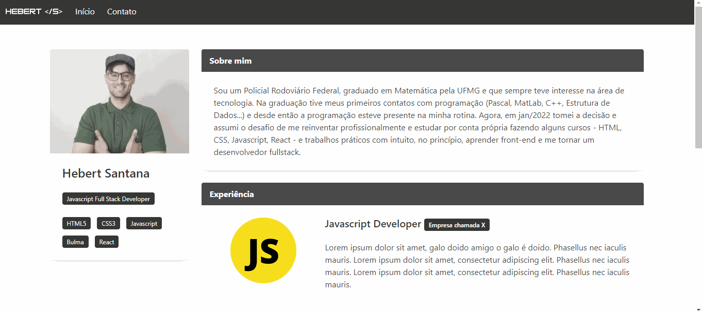

# Portfolio utilizando framework BULMA (UDEMY)
## Projeto (finalizado :white_check_mark:)

Colocando em prática o aprendizado no framework Bulma, com um projeto de uma página de portfolio durante da UDEMY.

## 🛠️ Recursos

* HTML
* CSS
* Bulma

## 💻 Demonstração
 

 
 

## 🌐 Site

<https://hebert-santana.github.io/portfolio-bulma/>

## Autor
~~~ javascript
by Hebert Santana
~~~